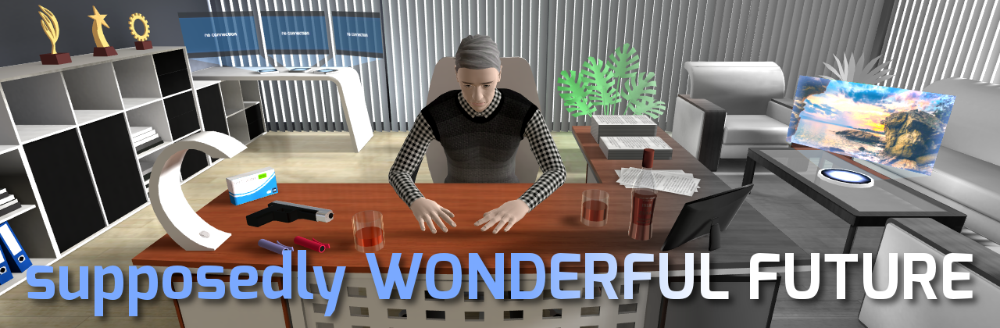

A sci-fi narrative game about screens, small rooms, and existential dread told through a series of RPG-style dialogues.

Released on Steam in 2018: https://store.steampowered.com/app/719210

This is the complete source project for the game in Unity v.5.5.0f3.
The easiest way to run it is probably to download and install that specific version
([archive](https://unity.com/releases/editor/archive),
[DDL](https://download.unity3d.com/download_unity/38b4efef76f0/Windows64EditorInstaller/UnitySetup64-5.5.0f3.exe),
[torrent](https://download.unity3d.com/download_unity/38b4efef76f0/Unity-5.5.0f3.torrent))
(multiple Unity versions should work fine side-by-side on one machine, at least the older ones did).
Upgrading the project to modern versions with some post-import tweaking should also be an option,
though I haven't tried it personally.

In addition to the Unity project, there's also a
[MEGA folder](https://mega.nz/folder/OJBTCbID#96izRxbZXSHb0AKVd4N0Hw)
with the following archives uploaded:

| Name | Size | Description
| --- | --- | ---
| SWF_Environment.rar | 3.6 GB | Blender models and GIMP textures for all assets except characters
| SWF_Characters.rar | 340 MB | Blender models and GIMP textures for characters
| SWF_Audio.rar | 890 MB | music, sounds and Audacity projects for those
| SWF_ReleaseTrailer.rar | 1.5 GB | trailer video editing project in Shotcut
| SWF_Marketing.rar | 220 MB | promotional materials and postmortem article
| SWF_additions_2020.rar | 140 MB | extra assets for Russian version that was added later
| SWF_SingularBuild.rar | 2.2 GB | final builds for Win, Linux and Mac

As is customary for personal passion projects, it's all a bit of a dump,
but it contains pretty much every file that was created while developing this game.
